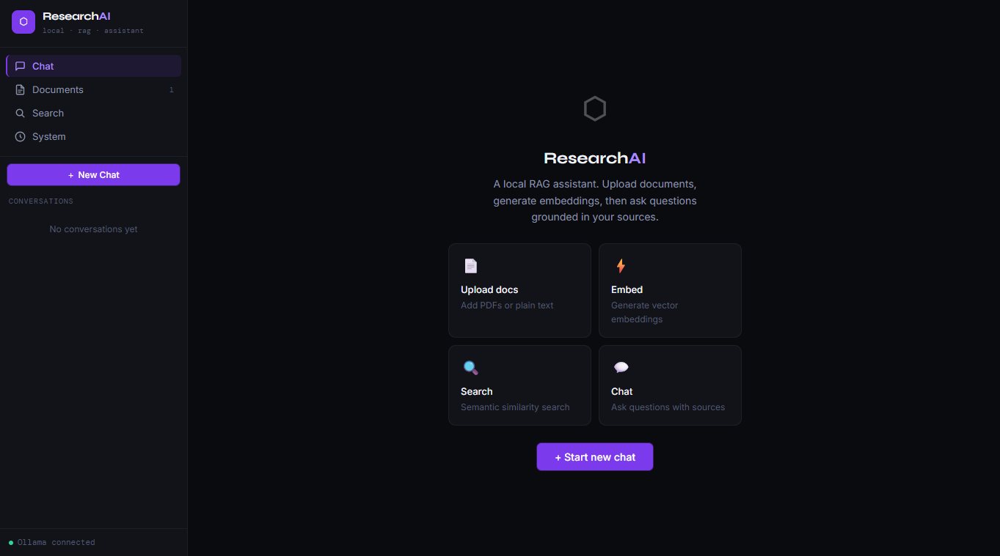
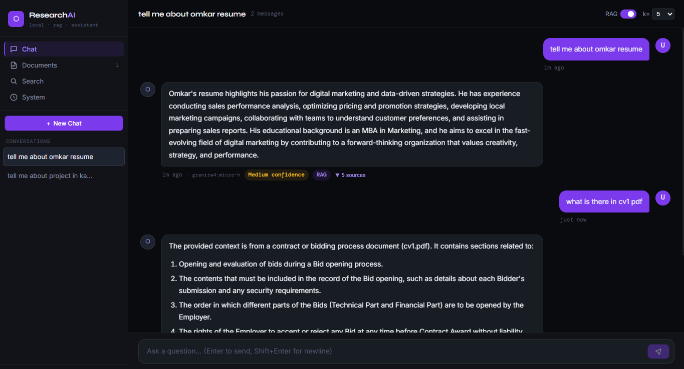
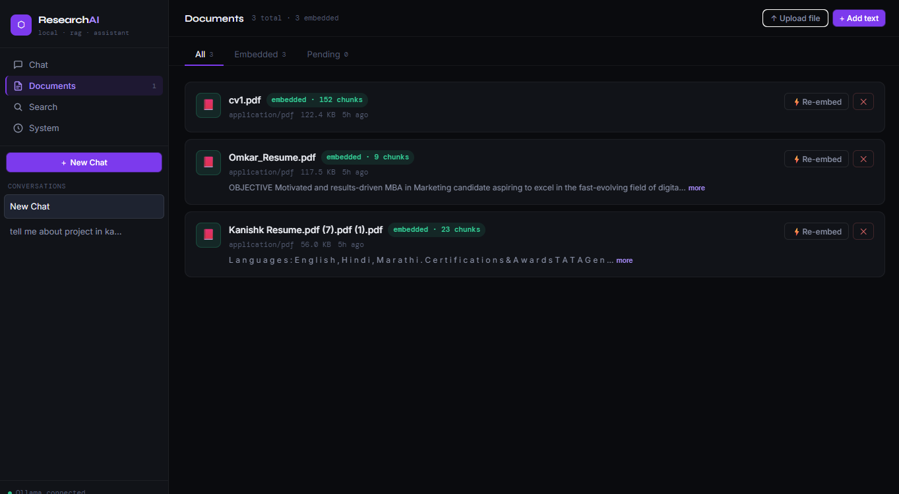
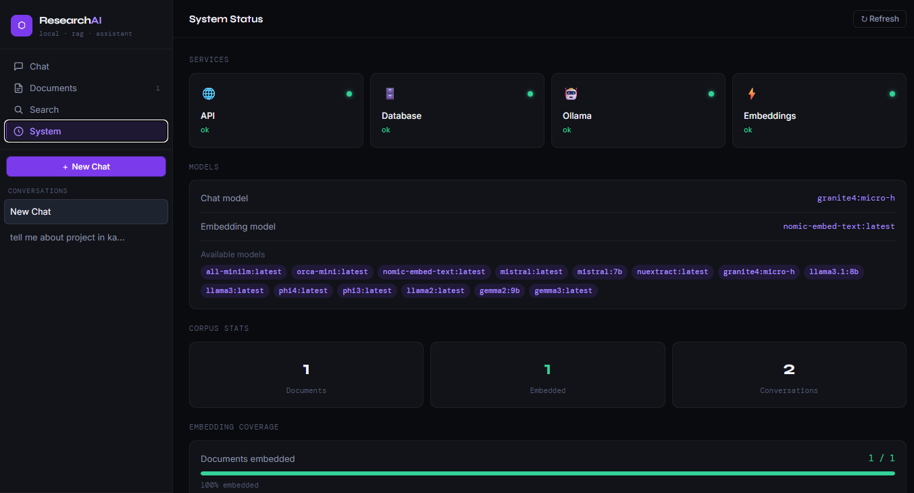

# 🔍 Research Assistant — Local RAG Fullstack

AI-powered **Retrieval-Augmented Generation (RAG)** system that allows users to upload documents, perform semantic search, and ask intelligent questions using local LLMs (Ollama).

---

## 🚀 Demo

🎥 Demo Video: *(https://drive.google.com/file/d/16ibcXMcFGYMfl0vJ8ixvbFvkTQjX2tC6/view?usp=sharing)*

---

## 📸 Screenshots

### 🏠 Dashboard



### 💬 Chat + Semantic Search



### 📄 Add Documents



### ⚙️ System Status



---

## 🧠 Features

* 📄 Upload documents (PDF/Text)
* 🔍 Semantic search using embeddings
* 🤖 Chat with documents (RAG)
* 🧩 Section-aware query understanding
* ⚡ FastAPI async backend
* 🎨 React (Vite) frontend
* 🔒 Fully local (privacy-first)

---

## 🏗️ Architecture

```
research-assistant-fullstack/
├── backend/      FastAPI + SQLAlchemy
├── frontend/     React + Vite
├── assets/       Screenshots
├── uploads/      User files
└── README.md
```

---

## 🛠️ Tech Stack

* **Backend:** FastAPI, SQLAlchemy (async)
* **Frontend:** React, Vite
* **LLM:** Ollama (local models)
* **Embeddings:** nomic-embed-text
* **Database:** SQLite

---

## ⚙️ Setup & Run

### 1. Start Ollama

```bash
ollama serve
```

### 2. Run Backend

```bash
python -m uvicorn backend.main:app --reload
```

### 3. Run Frontend

```bash
cd frontend
npm install
npm run dev
```

---

## 🧪 Example Queries

* What is inside the certifications section?
* What skills are mentioned?
* Summarize this document
* Extract key insights

---

## 🔄 End-to-End Flow

1. Upload document
2. Generate embeddings
3. Perform semantic search
4. Ask questions via chat
5. Get grounded responses

---

## ⚙️ Configuration

Configured via `.env`:

* OLLAMA_MODEL
* OLLAMA_EMBEDDING_MODEL
* CHUNK_SIZE
* TOP_K_RESULTS

---

## 🧩 Future Improvements

* FAISS / Chroma vector database
* Better PDF parsing
* Streaming responses
* Cloud deployment (Docker)

---

## 👨‍💻 Author

**Kanishk Joshi**
